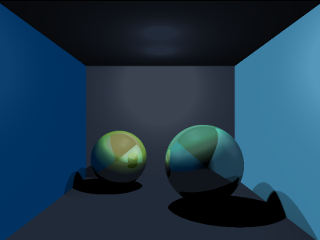

krayon
======

A simple raytracer. First written in 2003 as an experiment in ray tracing,
lighting, shading, and texture mapping.

## Features

* Primitive objects: spheres, planes
* Phong illumination model
* Reflections and shadows
* Point lights
* Inverse texture mapping
* Adaptive anti-aliasing

## License

Copyright © 2003-2017
